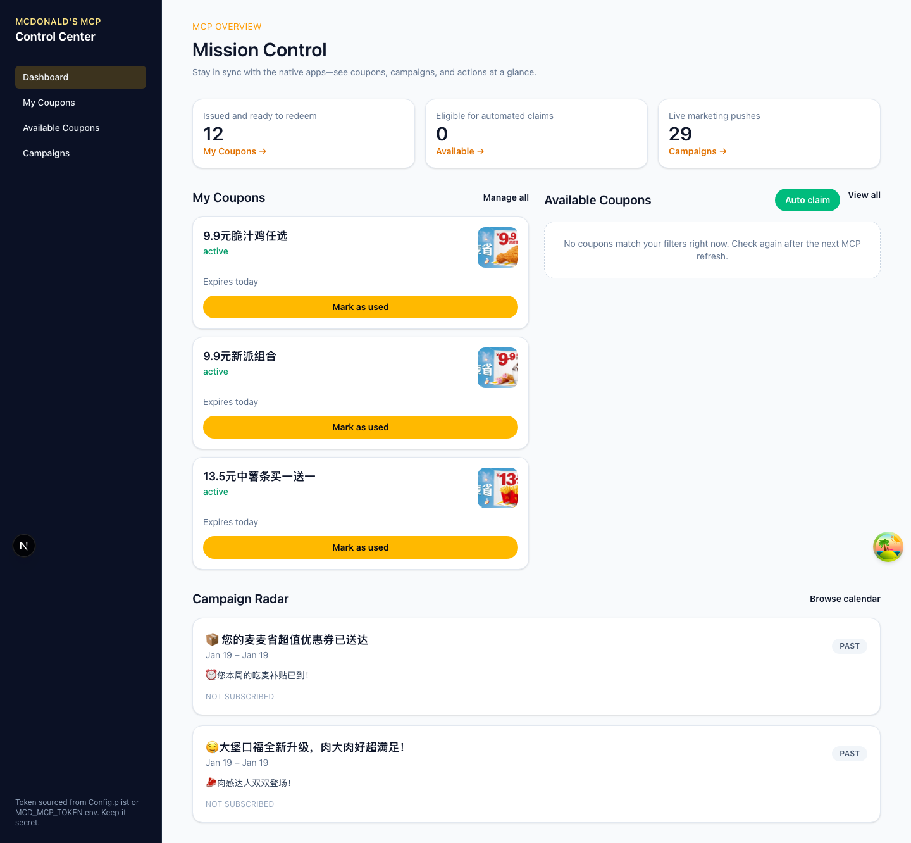
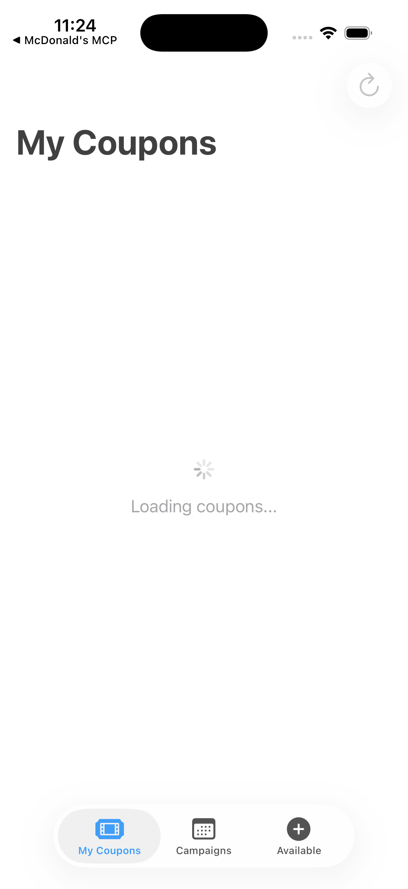

# MCD-App Monorepo

A multi-platform McDonald's MCP (Model Context Protocol) client application suite with shared Swift packages.

## Overview

This monorepo contains three platform-specific applications that share core business logic and UI components through Swift Package Manager (SPM) packages.

### Applications

- **[macOS App](apps/macos/README.md)** - Native macOS application
- **[iOS App](apps/ios/README.md)** - Native iOS application
- **[Web App](apps/web/README.md)** - Next.js web application

### Shared Packages

- **[MCDCore](packages/MCDCore/)** - Core business logic (models, services, view models)
- **[MCDSharedUI](packages/MCDSharedUI/)** - Shared SwiftUI components

## Screenshots

See the MCD-App suite in action across all platforms:

### Web Application


*Dashboard showing My Coupons, Available Coupons, and Campaign Radar*

### macOS Application


*Native macOS app with SwiftUI interface*

### iOS Application


*iOS app showing coupon list with expiry tracking*

## Quick Start

### Prerequisites

- **Swift Apps:** Xcode 15+ and macOS 14+ or iOS 17+
- **Web App:** Node.js 20+ and npm

### Running Applications

**macOS:**
```bash
cd apps/macos/MCD-macOS
swift run
```

**iOS:**
```bash
open apps/ios/MCD-iOS/MCD-iOS.xcodeproj
# Build and run in Xcode (Cmd+R)
```

**Web:**
```bash
cd apps/web
npm install
npm run dev
```

## Configuration

All applications require an MCP token. See individual app READMEs for platform-specific configuration:

- [macOS Configuration](apps/macos/README.md#configuration)
- [iOS Configuration](apps/ios/README.md#configuration)
- [Web Configuration](apps/web/README.md#configuration)

## Architecture

See [Architecture Overview](docs/architecture/overview.md) for system design and [SPM Workspace Guide](docs/architecture/spm-workspace.md) for package structure.

## Development

See [AGENTS.md](AGENTS.md) for development guidelines and coding standards.

## Project Structure

```
mcd-app/
├── apps/                   # Platform-specific applications
│   ├── ios/               # iOS app
│   ├── macos/             # macOS app
│   └── web/               # Next.js web app
├── packages/              # Shared Swift packages
│   ├── MCDCore/          # Core business logic
│   └── MCDSharedUI/      # Shared UI components
└── docs/                  # Documentation
    ├── architecture/      # Architecture docs
    ├── guides/           # Developer guides
    └── plans/            # Design documents
```

## License

Private project - All rights reserved
