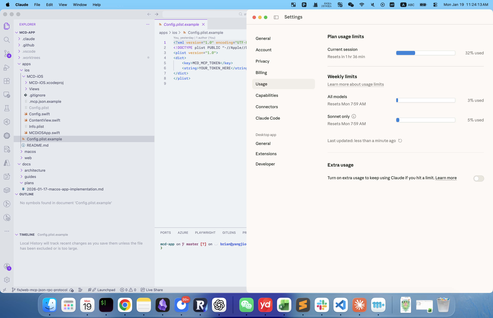

English | [简体中文](README.zh-CN.md) | [繁體中文](README.zh-TW.md)

# McDonald's MCP macOS App

A native macOS application for managing McDonald's coupons and campaigns through the MCP (Model Context Protocol) API.

## Features

- **My Coupons**: View and manage your available McDonald's coupons
- **Campaigns**: Browse current McDonald's marketing campaigns and calendar
- **Available Coupons**: Discover and claim new coupons from McDonald's promotions

## Screenshot



*Native macOS application showing the My Coupons view*

## Requirements

- macOS 14.0 or later
- Swift 5.9 or later
- Xcode 15.0 or later (for development)

## Building

To build the application:

```bash
swift build
```

For a release build with optimizations:

```bash
swift build -c release
```

## Running

To run the application:

```bash
swift run
```

The app will launch and connect to the McDonald's MCP API endpoint configured in your `~/.mcp.json` file.

## Architecture

This application follows the **MVVM (Model-View-ViewModel)** architecture pattern:

- **Models**: Data structures for Coupons, Campaigns, and API responses
- **Views**: SwiftUI views for the user interface (CouponListView, CampaignCalendarView, AvailableCouponsView)
- **ViewModels**: Business logic layer (CouponViewModel, CampaignViewModel)
- **Services**: API client (MCPClient) using URLSession for network communication

### Technology Stack

- **SwiftUI**: Modern declarative UI framework
- **Swift Concurrency**: async/await for asynchronous operations
- **URLSession**: Native networking layer
- **MCP API**: McDonald's Model Context Protocol integration

## Project Structure

```
MCDApp/
├── Package.swift           # Swift package manifest
├── README.md              # This file
├── MCDApp/                # Main application code
│   ├── MCDApp.swift       # App entry point
│   ├── Models/            # Data models
│   │   ├── Coupon.swift
│   │   ├── Campaign.swift
│   │   └── TimeInfo.swift
│   ├── Services/          # API client
│   │   └── MCPClient.swift
│   ├── ViewModels/        # Business logic
│   │   ├── CouponViewModel.swift
│   │   └── CampaignViewModel.swift
│   └── Views/             # SwiftUI views
│       ├── ContentView.swift
│       ├── CouponListView.swift
│       ├── CampaignCalendarView.swift
│       └── AvailableCouponsView.swift
└── MCDAppTests/           # Test suite
    ├── ModelTests.swift
    ├── MCPClientTests.swift
    ├── ViewModelTests.swift
    └── IntegrationTests.swift
```

## Configuration

### API Token Setup

You need a McDonald's China MCP API token. Configure it using one of these methods:

**Option A: Environment Variable (Recommended)**
```bash
export MCD_MCP_TOKEN=your_token_here
swift run
```

**Option B: Config File**
```bash
# Copy the template
cp MCDApp/Config.plist.example MCDApp/Config.plist

# Edit Config.plist and replace YOUR_TOKEN_HERE with your actual token
```

**Option C: For Claude Code MCP integration**
```bash
# Copy the template (in project root)
cp ../.mcp.json.example ../.mcp.json

# Edit .mcp.json and replace YOUR_TOKEN_HERE with your actual token
```

> ⚠️ **Security Note**: Never commit `Config.plist` or `.mcp.json` to git. These files are in `.gitignore`.

## Testing

Run the test suite:

```bash
swift test
```

The test suite includes:
- Model decoding tests
- ViewModel state tests
- MCPClient error handling tests
- Integration tests (skipped by default)

## License

Proprietary - McDonald's MCP Integration
